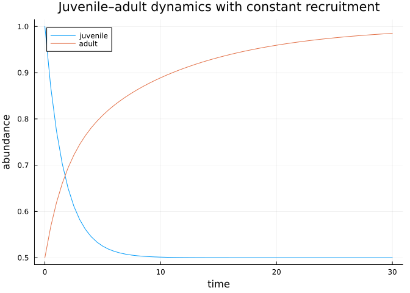
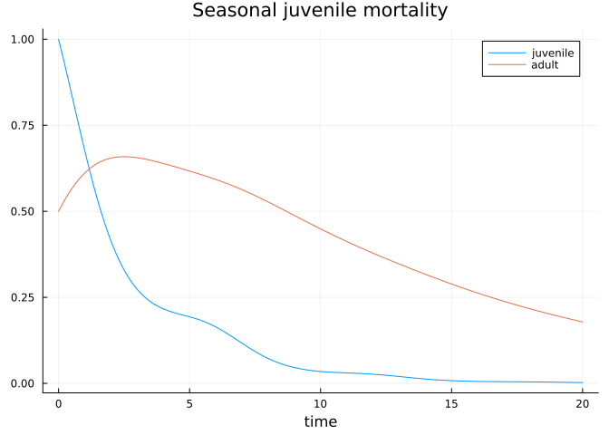

# Introduction to finite-state continuous-time dynamics
Simon Frost

- [Overview](#overview)
- [Setup](#setup)
- [A two-stage juvenile–adult model](#a-two-stage-juvenileadult-model)
- [Lowering and solving](#lowering-and-solving)
- [`remake` and dispatch
  restrictions](#remake-and-dispatch-restrictions)
- [Callable generators](#callable-generators)
- [Summary](#summary)

## Overview

**FiniteStatePopulationDynamics.jl** handles discrete-stage populations
evolving in continuous time via an infinitesimal generator matrix
$\mathbf{G}$. Given stage abundances $\mathbf{n}(t)$, the dynamics are

$$\frac{d\mathbf{n}}{dt} = \mathbf{G}\,\mathbf{n}(t) + \mathbf{s}(t),$$

where $\mathbf{s}(t)$ is an optional source/forcing term. The package
lowers these problems to SciML `ODEProblem`s (and `DDEProblem`s when
delays are present) and integrates them with any `OrdinaryDiffEq.jl`
solver.

This vignette introduces the core building blocks using a two-stage
juvenile–adult model.

## Setup

``` julia
using FiniteStatePopulationDynamics
using StructuredPopulationCore
using OrdinaryDiffEq
using Plots
```

The package exposes a handful of semantic marker types that classify the
problem kind:

``` julia
FiniteState() isa AbstractStateSemantics, ContinuousState() isa AbstractStateSemantics
```

    (true, true)

``` julia
ContinuousTime() isa AbstractTimeSemantics, DiscreteTime() isa AbstractTimeSemantics
```

    (true, true)

Structure traits further classify the model topology:

``` julia
SimpleFiniteStateStructure() isa AbstractFiniteStateDynamicsStructure,
GeneralFiniteStateStructure() isa AbstractFiniteStateDynamicsStructure,
SimpleFiniteStateStructure() isa AbstractProjectionStructure
```

    (true, true, true)

## A two-stage juvenile–adult model

Stages are held in a `DiscreteDomain`, itself an `AbstractStateDomain`:

``` julia
domain = DiscreteDomain([:juvenile, :adult])
domain isa AbstractStateDomain, n_states(domain)
```

    (true, 2)

Each stage is addressable by symbol, string, or index via `state_index`:

``` julia
state_index(domain, :juvenile), state_index(domain, "adult"), state_index(domain, 2)
```

    (1, 2, 2)

The generator encodes three flows: juvenile mortality, maturation to
adult, and adult mortality. Columns sum to $\le 0$:

``` julia
mu_J = 0.4   # juvenile mortality rate
gamma = 0.2  # maturation rate
mu_A = 0.1   # adult mortality rate
G = [-(mu_J + gamma)   0.0;
           gamma     -mu_A]
```

    2×2 Matrix{Float64}:
     -0.6   0.0
      0.2  -0.1

A constant source term adds juveniles via density-independent
recruitment:

``` julia
source = [0.3, 0.0]
u0 = [1.0, 0.5]
prob = FiniteStateGeneratorProblem(G, domain, u0, (0.0, 30.0); source = source)
prob isa AbstractFiniteStateDynamicsProblem
```

    true

## Lowering and solving

The problem lowers to a SciML `ODEProblem`:

``` julia
odeprob = to_ode_problem(prob)
sol = solve(odeprob, Tsit5(); saveat = 0.5)
plot(sol.t, hcat(sol.u...)'; labels = ["juvenile" "adult"],
     xlabel = "time", ylabel = "abundance",
     title = "Juvenile–adult dynamics with constant recruitment")
```



`solve` also dispatches directly on the FSPD problem:

``` julia
sol2 = solve(prob, Tsit5(); saveat = 30.0)
sol2.u[end]
```

    2-element Vector{Float64}:
     0.5000023277004855
     0.9850627516817598

## `remake` and dispatch restrictions

`remake` updates fields on a problem without rebuilding it from scratch:

``` julia
prob_long = FiniteStatePopulationDynamics.remake(prob; tspan = (0.0, 60.0))
prob_long.tspan
```

    (0.0, 60.0)

FSPD is a continuous-time package. Semantic solvers for discrete-time
iteration or direct eigenanalysis are accepted only as error
documentation:

``` julia
try
    solve(prob, DirectIteration())
catch err
    err
end
```

    ArgumentError("DirectIteration is not defined for FiniteStateGeneratorProblem; use a SciML ODE algorithm instead.")

``` julia
try
    solve(prob, EigenAnalysis())
catch err
    err
end
```

    ArgumentError("EigenAnalysis is not defined for FiniteStateGeneratorProblem; use to_ode_problem or a SciML ODE solve instead.")

## Callable generators

Generators can be time- and parameter-dependent. The signature is
`(u, p, t) -> Matrix`:

``` julia
mu_seasonal(u, p, t) = [-(p.mu0 + p.A*sin(t))  0.0;
                         p.gamma              -p.mu_A]
prob_cal = FiniteStateGeneratorProblem(
    mu_seasonal,
    domain,
    u0,
    (0.0, 20.0);
    p = (mu0 = 0.3, A = 0.2, gamma = 0.2, mu_A = 0.1),
)
sol_cal = solve(to_ode_problem(prob_cal), Tsit5(); saveat = 0.2)
plot(sol_cal.t, hcat(sol_cal.u...)'; labels = ["juvenile" "adult"],
     xlabel = "time", title = "Seasonal juvenile mortality")
```



## Summary

- Build a `DiscreteDomain`, a generator matrix `G`, and wrap both in a
  `FiniteStateGeneratorProblem`.
- Lower with `to_ode_problem` or call `solve` directly; pass any
  `OrdinaryDiffEq` algorithm.
- Abstract types (`AbstractFiniteStateDynamicsStructure`,
  `AbstractStateDomain`, `AbstractStateSemantics`,
  `AbstractTimeSemantics`, `AbstractProjectionStructure`,
  `AbstractFiniteStateDynamicsProblem`) classify every concrete type in
  the API.

Subsequent vignettes cover events/callbacks (vignette 02) and
delay-generator dynamics (vignette 03).
