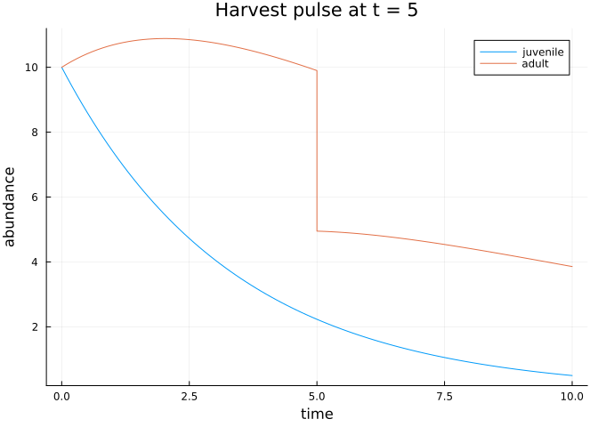
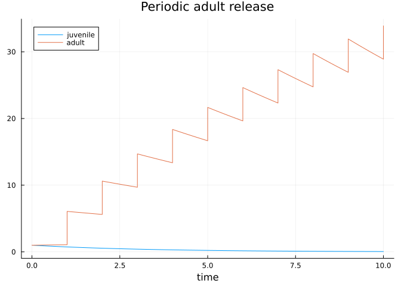
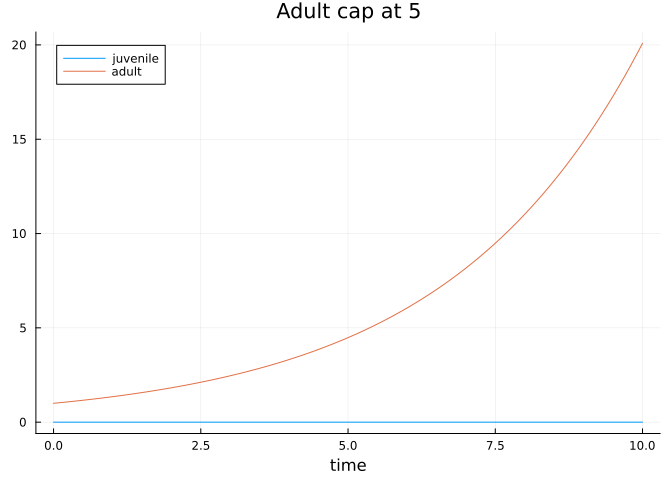
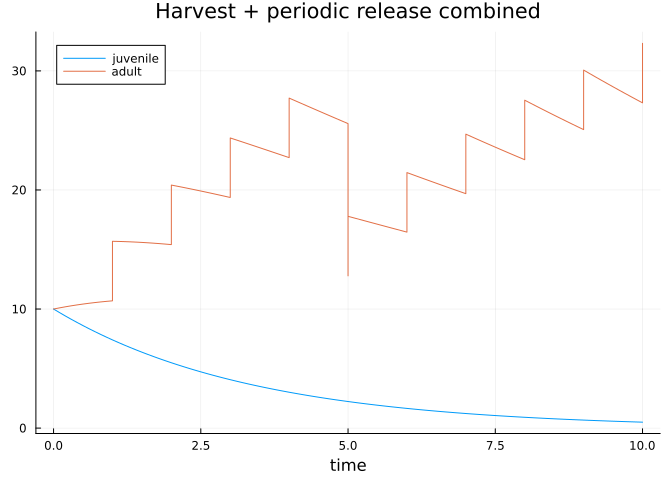

# Events and callbacks
Simon Frost

- [Overview](#overview)
- [Setup](#setup)
- [State mutators](#state-mutators)
- [Scheduled events](#scheduled-events)
- [Periodic events](#periodic-events)
- [Threshold events](#threshold-events)
- [Combining callbacks](#combining-callbacks)
- [Summary](#summary)

## Overview

Discrete management actions — harvest pulses, periodic releases,
threshold-triggered interventions — are natural for continuous-time
population models. FSPD exposes three event helpers on top of SciML
callbacks, plus mutators that operate on an integrator by stage name.

## Setup

``` julia
using FiniteStatePopulationDynamics
using StructuredPopulationCore
using OrdinaryDiffEq
using Plots

domain = DiscreteDomain([:juvenile, :adult])
G = [-0.3   0.0;
      0.2  -0.1]
```

    2×2 Matrix{Float64}:
     -0.3   0.0
      0.2  -0.1

## State mutators

The mutators take an `integrator` (or any struct with a `u` field) and
update abundances by stage name or index:

``` julia
mutable struct DemoIntegrator
    u::Vector{Float64}
end
integ = DemoIntegrator([10.0, 20.0])

set_state!(integ, domain, :juvenile, 5.0)
integ.u
```

    2-element Vector{Float64}:
      5.0
     20.0

``` julia
add_to_state!(integ, domain, :adult, 1.5)
integ.u
```

    2-element Vector{Float64}:
      5.0
     21.5

``` julia
scale_state!(integ, domain, :juvenile, 0.5)
integ.u
```

    2-element Vector{Float64}:
      2.5
     21.5

``` julia
transfer_state!(integ, domain, :juvenile, :adult, 1.0)
integ.u
```

    2-element Vector{Float64}:
      1.5
     22.5

`transfer_state!` clamps when the source is insufficient:

``` julia
transfer_state!(integ, domain, :juvenile, :adult, 99.0)
integ.u
```

    2-element Vector{Float64}:
      0.0
     24.0

## Scheduled events

`scheduled_event(time, affect!)` fires once at `time`. The `affect!`
closure receives the integrator. Here we harvest 50% of adults at
`t = 5`:

``` julia
harvest_time = 5.0
harvest! = integ -> scale_state!(integ, domain, :adult, 0.5)
harvest_cb = scheduled_event(harvest_time, harvest!)

prob = FiniteStateGeneratorProblem(G, domain, [10.0, 10.0], (0.0, 10.0);
                                   callbacks = harvest_cb)
sol = solve(prob, Tsit5(); tstops = [harvest_time], saveat = 0.1)

plot(sol.t, hcat(sol.u...)'; labels = ["juvenile" "adult"],
     xlabel = "time", ylabel = "abundance",
     title = "Harvest pulse at t = 5")
```



## Periodic events

`periodic_event(dt, affect!; t0)` fires every `dt` units starting at
`t0`. This demo releases 5 adults once per unit time:

``` julia
release_cb = periodic_event(1.0, integ -> add_to_state!(integ, domain, :adult, 5.0);
                            t0 = 1.0)

prob_rel = FiniteStateGeneratorProblem(G, domain, [1.0, 1.0], (0.0, 10.0);
                                       callbacks = release_cb)
sol_rel = solve(prob_rel, Tsit5(); tstops = collect(1.0:1.0:10.0), saveat = 0.1)

plot(sol_rel.t, hcat(sol_rel.u...)'; labels = ["juvenile" "adult"],
     xlabel = "time", title = "Periodic adult release")
```



## Threshold events

`threshold_event(condition, affect!)` fires when the continuous
condition crosses zero. Here we cap adult abundance at 5:

``` julia
cap_condition(u, t, integ) = u[state_index(domain, :adult)] - 5.0
cap_affect!(integ) = set_state!(integ, domain, :adult, 5.0)
cap_cb = threshold_event(cap_condition, cap_affect!)

G_growth = [ 0.0   0.0;
             0.2   0.3]  # adult growth
prob_cap = FiniteStateGeneratorProblem(G_growth, domain, [0.0, 1.0], (0.0, 10.0);
                                        callbacks = cap_cb)
sol_cap = solve(prob_cap, Tsit5(); saveat = 0.1)

plot(sol_cap.t, hcat(sol_cap.u...)'; labels = ["juvenile" "adult"],
     xlabel = "time", title = "Adult cap at 5")
```



## Combining callbacks

`combine_callbacks` merges two callback objects, handling `nothing`
transparently:

``` julia
combined = combine_callbacks(harvest_cb, release_cb)
combined isa SciMLBase.CallbackSet
```

    true

``` julia
combine_callbacks(nothing, harvest_cb) === harvest_cb,
combine_callbacks(nothing, nothing) === nothing
```

    (true, true)

A problem’s stored callback is merged with anything passed to `solve`:

``` julia
prob_combined = FiniteStateGeneratorProblem(G, domain, [10.0, 10.0], (0.0, 10.0);
                                            callbacks = harvest_cb)
sol_combined = solve(prob_combined, Tsit5();
                     callback = release_cb,
                     tstops = vcat(harvest_time, collect(1.0:1.0:10.0)),
                     saveat = 0.1)
plot(sol_combined.t, hcat(sol_combined.u...)'; labels = ["juvenile" "adult"],
     xlabel = "time",
     title = "Harvest + periodic release combined")
```



## Summary

- State mutators: `set_state!`, `add_to_state!`, `scale_state!`,
  `transfer_state!` resolve stages through `state_index`.
- Event helpers: `scheduled_event`, `periodic_event`, `threshold_event`
  wrap SciML callbacks with a stage-name-friendly API.
- `combine_callbacks` lets you layer problem-stored and solver-passed
  callbacks.
