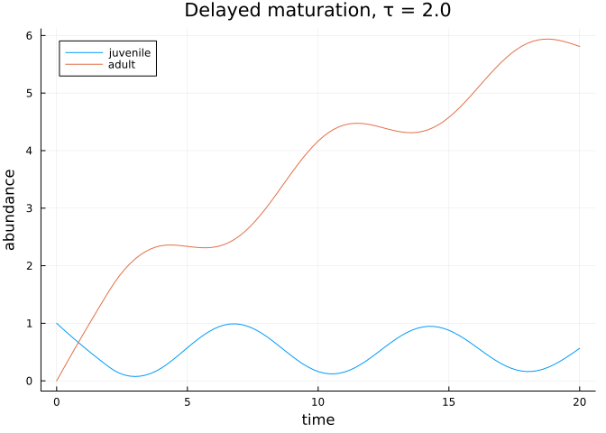
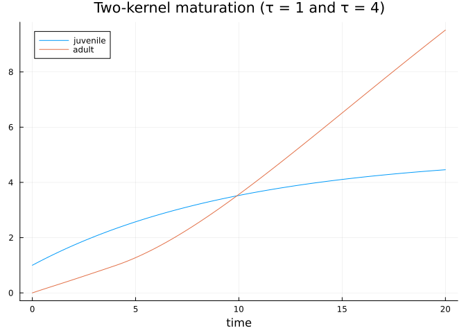

# Delay-generator dynamics
Simon Frost

- [Overview](#overview)
- [Setup](#setup)
- [A delayed maturation model](#a-delayed-maturation-model)
- [Lowering and solving](#lowering-and-solving)
- [Multiple delay kernels](#multiple-delay-kernels)
- [`remake` on delay problems](#remake-on-delay-problems)
- [Summary](#summary)

## Overview

Many population processes incorporate time lags — maturation delays,
gestation, cohort effects. FSPD supports **delay-generator terms** of
the form

$$\frac{d\mathbf{n}}{dt} = \mathbf{G}\,\mathbf{n}(t) +
  \sum_k \mathbf{H}_k\, \mathbf{n}(t - \tau_k) + \mathbf{s}(t),$$

lowered to SciML `DDEProblem`s via `to_dde_problem` and solved with
`DelayDiffEq.MethodOfSteps`.

## Setup

``` julia
using FiniteStatePopulationDynamics
using StructuredPopulationCore
using OrdinaryDiffEq
using DelayDiffEq
using Plots
```

## A delayed maturation model

Consider a two-stage juvenile–adult model in which juveniles mature only
after a fixed developmental delay $\tau$:

``` julia
domain = DiscreteDomain([:juvenile, :adult])

mu_J = 0.1    # juvenile mortality
mu_A = 0.05   # adult mortality
tau = 2.0     # maturation delay

# Instantaneous terms: only mortality
G = [-mu_J   0.0;
      0.0  -mu_A]

# Delayed maturation: the juveniles that survived τ units ago
# become adults now.
H = [-exp(-mu_J*tau)  0.0;
      exp(-mu_J*tau)  0.0]
delay_term = DelayGeneratorTerm(tau, H)
delay_term isa DelayGeneratorTerm
```

    true

A constant source replenishes juveniles; the history function gives the
pre-start state:

``` julia
history(p, t) = [1.0, 0.0]
prob = DelayFiniteStateProblem(
    G, [delay_term], domain,
    [1.0, 0.0], history, (0.0, 20.0);
    source = [0.5, 0.0],
)
prob isa AbstractFiniteStateDynamicsProblem
```

    true

## Lowering and solving

Lower to a SciML `DDEProblem`:

``` julia
ddeprob = to_dde_problem(prob)
sol = solve(ddeprob, MethodOfSteps(Tsit5()); saveat = 0.2)
plot(sol.t, hcat(sol.u...)'; labels = ["juvenile" "adult"],
     xlabel = "time", ylabel = "abundance",
     title = "Delayed maturation, τ = $tau")
```



The `solve` wrapper dispatches directly on the delay problem too:

``` julia
sol_direct = solve(prob, MethodOfSteps(Tsit5()); saveat = 20.0)
sol_direct.u[end]
```

    2-element Vector{Float64}:
     0.5639834026195565
     5.8095911171326255

## Multiple delay kernels

A problem can carry an arbitrary list of `DelayGeneratorTerm`s with
different lags:

``` julia
short_term = DelayGeneratorTerm(1.0, [0.0 0.0; 0.05 0.0])   # fast trickle
long_term  = DelayGeneratorTerm(4.0, [0.0 0.0; 0.20 0.0])   # bulk maturation

prob_multi = DelayFiniteStateProblem(
    G, [short_term, long_term], domain,
    [1.0, 0.0], history, (0.0, 20.0);
    source = [0.5, 0.0],
)
sol_multi = solve(to_dde_problem(prob_multi), MethodOfSteps(Tsit5()); saveat = 0.2)
plot(sol_multi.t, hcat(sol_multi.u...)'; labels = ["juvenile" "adult"],
     xlabel = "time", title = "Two-kernel maturation (τ = 1 and τ = 4)")
```



## `remake` on delay problems

``` julia
prob_long = FiniteStatePopulationDynamics.remake(prob; tspan = (0.0, 40.0))
prob_long.tspan
```

    (0.0, 40.0)

## Summary

- `DelayGeneratorTerm(τ, H)` stores one delay kernel with lag `τ` and
  generator matrix `H`.
- `DelayFiniteStateProblem` holds the instantaneous generator, a vector
  of delay terms, the domain, history function, and tspan.
- `to_dde_problem` lowers to SciML; `MethodOfSteps(·)` solves.
- This closes the core FSPD API surface; all concrete problem types,
  structures, and state/time semantic markers are now exercised across
  vignettes 01–03.
